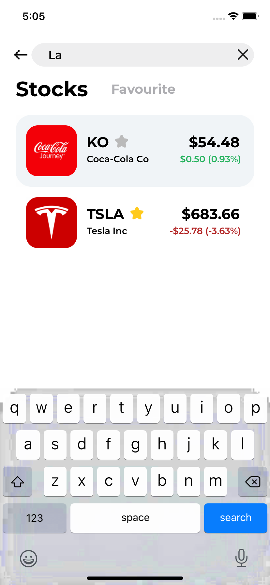
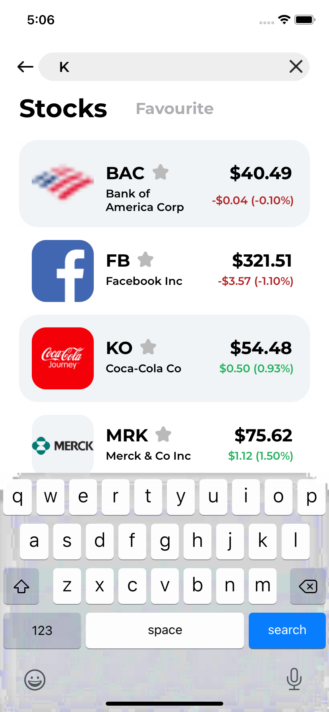
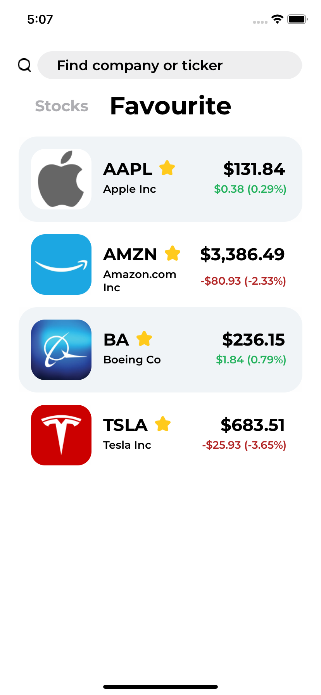
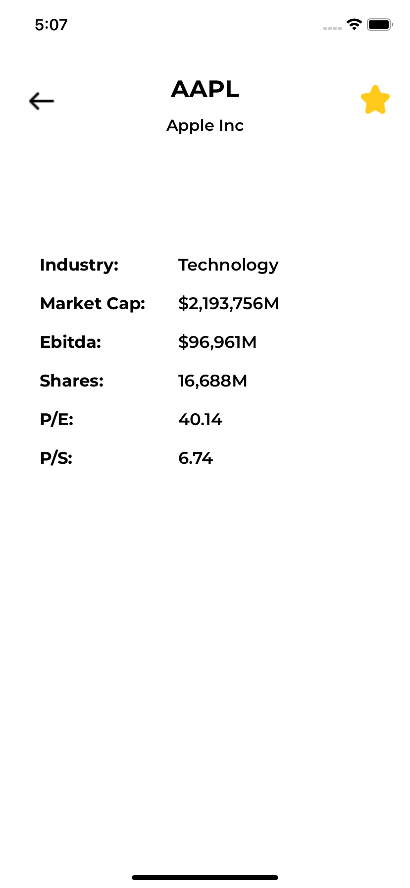
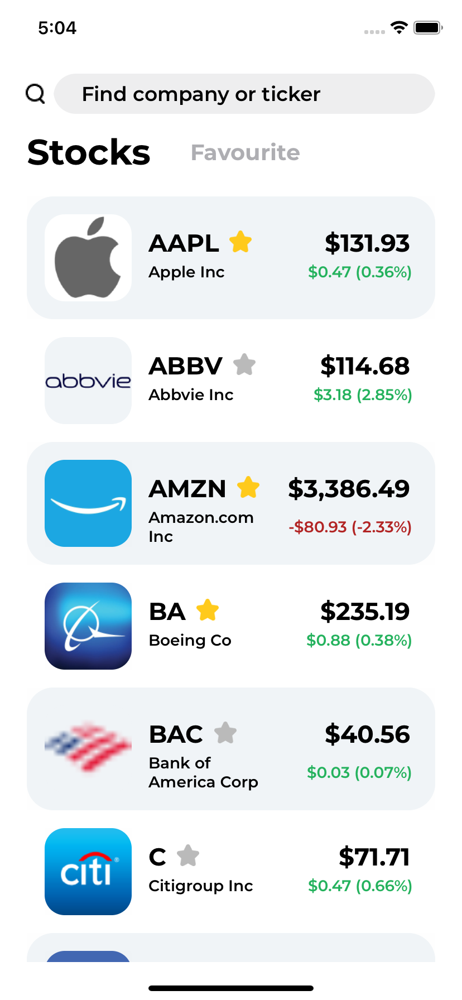
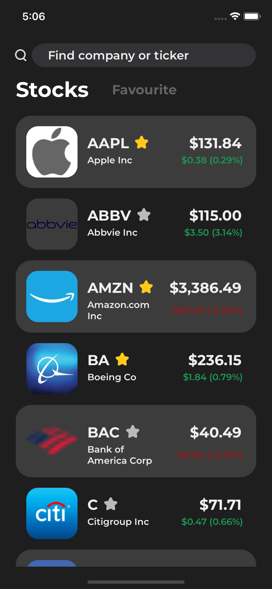
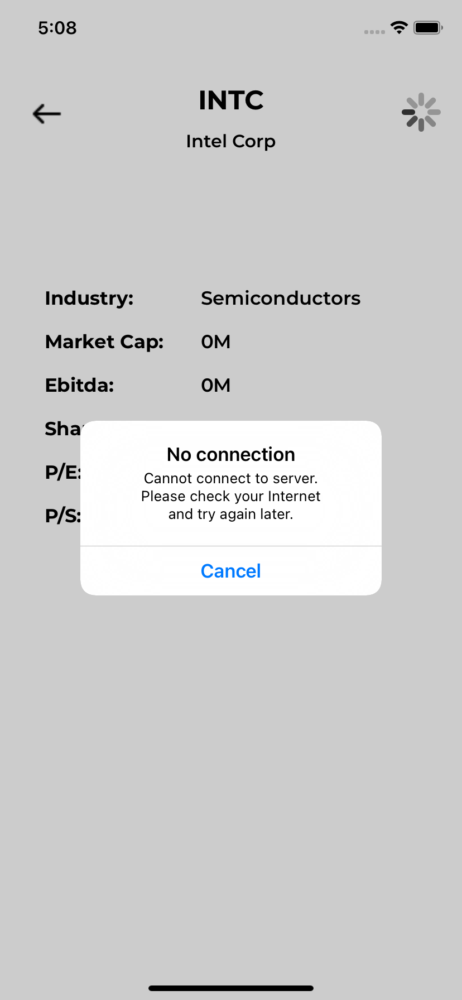

# YaMDS

This is a test project for Yandex Mobile Development School 2021.

The App dislays stock market data about company including current price, basic financials and logo.

# Table of Contents
1. [Features](#Features)
2. [API](#API)
3. [Used Libraries](#Used-3rd-party-Libs)

# Features

### Basic
- `Search` through tickers and company names

  

- List of `Favourite` companies

### Additional
- `Detail View` with several financials for chosen company

- `Light/Dark appearance` inheriting from device theme

  

- `Alert notification` on errors (including connection loss and API requests limit)

- Stock price `live updates` via WebSockets

- `Caching` company cards in memory with CoreData

- Simple `animation` for favourite buttons

# API
### Stock data obtained from [Finnhub Stock API](https://finnhub.io/docs/api).
Used requests:
- [Company Profile 2](https://finnhub.io/docs/api/company-profile2)
- [Basic Financials](https://finnhub.io/docs/api/company-basic-financials)
- [Quote](https://finnhub.io/docs/api/quote)

### Source of company logos:
- Link from Finnhub response
- [UpLead](https://docs.uplead.com/#company-logo-api)

### ~~Company summary block for Detail View~~ (not activated in final build)
- [MBOUM API](https://mboum.com/api/documentation#profile)

# Used 3rd party Libs
- [SwiftyJSON](https://github.com/SwiftyJSON/SwiftyJSON)
- [Kingfisher](https://github.com/onevcat/Kingfisher)
- [Starscream](https://github.com/daltoniam/Starscream)
